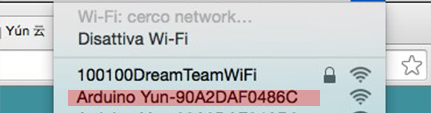
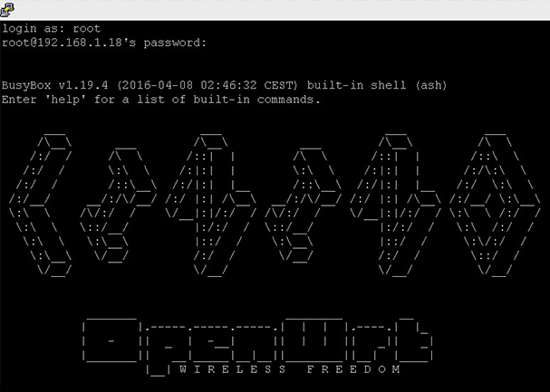

# An-Automated-Pet-Detector
This automated Pet detector is designed for pets (cats and dogs) and their owners 
Basic guide to set up a camera with Arduino Yún shield. As well as the guide to build an avoid car with a motor shield.

<h1>PART 1</h1>
<h2>Set up a camera with Arduino Yún shield</h2>

<h3>About Arduino Yún shield</h3>

The Arduino Yún is a microcontroller board based on the ATmega32u4 and the Atheros AR9331. The Atheros processor supports a Linux distribution based on OpenWrt named Linino OS. The board has built-in Ethernet and WiFi support, a USB-A port, micro-SD card slot, 20 digital input/output pins (7 of them can be used as PWM outputs and 12 as analog inputs), a 16 MHz crystal oscillator, a micro USB connection, an ICSP header, and 3 reset buttons. (https://www.arduino.cc/en/Main/ArduinoBoardYun)

It is good to note that there is a different set up between “Arduino yun” and “dragino Arduino yun”. Thanks to my professor for lending me his Arduino yun, so that I have the opportunity to study it.

  
  
  

<h2>Tutorial</h2>

<h3>Code and technical support:</h3>
	<ul>
		<li>Breakout</li>
		<li>JavaScript</li>
		<li>Blue tooth </li>
	</ul>

<h3>The Materials you Need:</h3>
	<ul>
		<li>Arduino Yun Shield   1</li>
		<li>4WD ROBOT PLATFORM   1 </li>
		<li>USB video Camera  1 </li>
		<li>Motor shield   1</li>
		<li>Arduino board 1 </li>
		<li>Servo 1 </li>
		<li>SD card (I use 32G) 1 </li>
		<li>Sensor 1 </li>
		<li>4W car package 1 </li>
		<li>Others: breadboard, jumper wire, etc.</li>
	</ul>

<h3>1. Set up the Ardunio Yun</h3>

Before starting the project, we need to set up the Ardunio Yun.There are several steps to do this:

(a).Connect to the Ardunio Yun over Wifi. Plug or power up the Yun with the computer. Wait about a few minutes till you see the white USB LED turn on. Then, you can check the available WiFi Networks for a new one called something like: ARDUINO-YUN90XXXXXX. Select this WiFi.

(b).Open a browser and visit 192.168.240.1. If this is your first time setting up yun, the default password is "arduino".  So, just enter "arduino" and click the Log In button.

(c).Connect your Arduino WiFi. Once your Arduino Yun has logged in, click the Configure Button in the top right. Here you can:

	<ol>
		<li>Change the Arduino Yun’ name if you want.</li>
		<li>Change the password (the default password is "arduino").</li>
		<li>Connect your Arduino yun to a WiFi network.</li>
	</ol>

(d).After you press the Configure & Restart button, the shield will reset itself and join the specified network.

<b>If you still have some questions about setting up the yun, you can go to YOUTUBE
To view the tutorial video: https://www.youtube.com/watch?v=9-hPhWHWnvs</b>

<h3>2. Do some tests for the Arduino yun, make sure it works. </h3>

You can use the “ConsoleRead” which can be found in the “Bridge” folder. It on the Arduino IDE, if you don't have this file, you need to install and set up it first.

<h3>3. Set up SSH. </h3>

https://support.suso.com/supki/SSH_Tutorial_for_Windows

Go through the Web and setup it.

<h3>4. Use SSH to root Yun. Local </h3>
	

<h3>5. Update and install packages.</h3>

<b>Enter the code:</b>

opkg update

opkg install kmod-video-uvc

opkg install fswebcam

<b>If it doesn't work, try this:</b>

opkg update

opkg install kmod-video-uvc --force-sepends

opkg install fswebcam --force-sepends

<b>Or find the package path, so that the SSH could directly download and install the package through the web site. Code looks like below:</b>

wget http://download.linino.org/linino_distro/lininoIO/latest/packages/kmod-video-uvc_3.3.8-1_ar71xx.ipk

wget http://download.linino.org/linino_distro/lininoIO/latest/packages/mod-video-videobuf2_3.3.8-1_ar71xx.ipk

wget http://download.linino.org/linino_distro/lininoIO/latest/packages/kmod-input-core_3.3.8-1_ar71xx.ipk

opkg install kmod-video-videobuf2_3.3.8-1_ar71xx.ipk

opkg install kmod-input-core_3.3.8-1_ar71xx.ipk

opkg install kmod-video-uvc_3.3.8-1_ar71xx.ipk

<h3>6. Testing the Camera.</h3>

<b>Conact yor camera with yun, then enter the code:</b>

cd /mnt/sda1

fswebcam pic1.jpg -r 1280x720

<h3>End of this stape your camera should be set up and take pictures through SSH.</h3>

I am temporarily stoped here for some reason. However, I will keep going and continue to update the project that it developed to an web camera. if you are interested for my project, please keep tracking.

<h1>PART 2</h1>

<h3>1.Assemble the basic parts of the car</h3>

<h3>2.Set the Servo and sensor on the front of the car</h3>

<h3>3.Connect a motor with wheels</h3>

<h3>4. Connections</h3>

<b>Connect all the stuff together.</b>

<h3>5. Inset Code</h3>

<b>Please download and inset the code in code file</b>

The car will detect the front and left and right distance in 1.5 seconds, make a comparison, and then make a decision to move forward, turn right, turn left or back. 

<h1>PART 3</h1>
<h3><b>To be continued: </b>combine and  modify the code to complete the project.</h3>

If you are interested for my project, please keep tracking.

